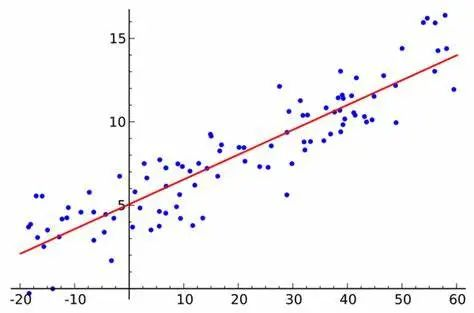
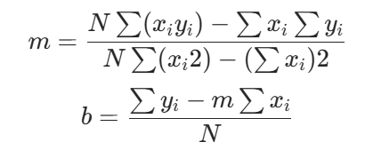

# 1. Introduction

To implement linear fit in C + +, the slope and intercept of the best fitting line can be calculated by least square method. The following is a complete linear fitting function to achieve, including input data points, the calculation of the slope and intercept, and output fitting results. 



# 2. Process

Linear conformation formula Given a set of data points (xi, yi), the goal of linear fitting is to find a straight line (y = mx + b) such that the error squares sum is minimized.The formula for calculating the slope and intercept is as follows: 



where ( N )  Is the number of data points. ( m )  It's the slope. (b) is the intercept.

# 3. Code Notes
1. Input data The x and y are two std:: vector < double > that store the (x) and (y) coordinates of the data point, respectively. If the size of x and y is inconsistent or empty, an exception is thrown. 
2. Counting various items and SumX: the sum of (x _ i). SumY: the sum of (y _ i). SumXY: the sum of (x _ i y _ i). Sum X2: the sum of (x _ i ^ 2). 
3. Calculate slope and intercept Calculate the slope using the least squares formula （ m ） And intercept （ b ) 。 
4. Return results Returns the slope and intercept using std:: tuple < double, double >. 
5. Prediction of new value Predict the new (y) value using the fitted linear equation (y = mx + b). 
03 summary The slope and intercept of the best fitting line can be calculated by the least square method. 

Compile and link the C++ code with:
    
    ```
       g++ LinearFitting.cpp -o LinearFitting 
    ```

then run the executable with:

    ```
       ./LinearFitting 
    ```
